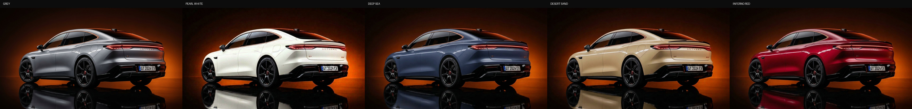

# Mercuria — Electric Grand Touring

Landing page + live configurator for the Mercuria GT 001 electric grand tourer.
Built with React 19, Vite 7 and Tailwind CSS 4.



## Features

- **Live configurator** — switch between five factory colours:
  Lunar Grey, Pearl White, Deep Sea, Desert Sand and Inferno Red.
  Each colour/view pair is a pre-rendered photorealistic image (AI-generated
  from the original studio photos), swapped instantly with a soft crossfade —
  no runtime recolouring, so wheels, mirrors, glass, plate area, shadows and
  background stay pixel-identical to the original photos in every colour.
- **Two views** — rear quarter and front, with instant crossfade.
- Price summary updates with the selected colour (base price $189,000).

## Demo

- GitHub Pages: **https://&lt;your-username&gt;.github.io/&lt;repo-name&gt;/**
  (auto-deployed by `.github/workflows/deploy.yml` on every push to `main`)
- Vercel fallback: import the repo at [vercel.com/new](https://vercel.com/new) —
  Vite is auto-detected, no extra config needed.

## Tech stack

| Layer    | Tools                                          |
| -------- | ---------------------------------------------- |
| UI       | React 19, TypeScript, Tailwind CSS 4           |
| Build    | Vite 7 (`vite-plugin-singlefile`)              |
| Animation| framer-motion, lucide-react icons              |
| Dev tooling | `scripts/make_masks.py` — QA masks used while calibrating the colour variants |

## Getting started

```bash
npm install
npm run dev      # local dev server
npm run build    # production build -> dist/
```

## Project structure

```
public/images/        studio photos + per-colour configurator renders
src/components/       Hero, Configurator, Exterior, Performance, ...
scripts/make_masks.py python QA tooling (masks for the configurator renders)
docs/                 preview assets
```

## Colour variants

| Colour       | Hex       | Surcharge |
| ------------ | --------- | --------- |
| Lunar Grey   | —         | included  |
| Pearl White  | `#efede4` | +$1,500   |
| Deep Sea     | `#39466b` | +$1,500   |
| Desert Sand  | `#e4d7b4` | +$2,500   |
| Inferno Red  | `#ce1730` | +$3,000   |

---

### По-русски

Лендинг и конфигуратор Mercuria GT 001. При смене цвета кузов подменяется
заранее сгенерированными фотореалистичными изображениями — колёса, зеркала,
стёкла, зона номера, тени и фон во всех цветах пиксельно совпадают с
оригинальными серыми фото. Демо деплоится на GitHub Pages автоматически при
пуше в `main` (workflow уже настроен); для Vercel достаточно импортировать
репозиторий.
